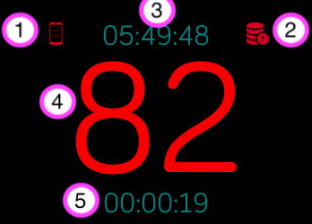

# HR Streamer

This repo is the code for the Fitbit SDK HR Streamer app.

The app displays your heart rate, the current time, and the running time. Every new HR reading a message is set to the companion app which will make a get request to a server specified in the settings with the HR and a timestamp. This only makes unauthentated requests right now so I dont suggest having it stream to an externally visible address. It is intended to hit servers on your local network.

The interface between the app and the server is a simple http post with the following post body with two parameters "hr" an integer representing the heart rate and "timestamp" represented as seconds from the epoc. [Example Server Implementation](server.py)

The server url is kept in the companion app settings page

This is an annotated screenshot of the app running

1. If the sad phone is visible it suggests a problem sending messages to the companion app
2. If the sad server is visible it suggests the companion has failed to send data to the server
3. The current Time
4. Heart rate
5. Time the app has been running for

I use this app to stream my heart rate to my computer when I am biking and playing games I use the [Heart Rate Hud](https://github.com/Bachmann1234/HeartRateHud) to do that.

Icons made by [Freepik](http://www.freepik.com) from [www.flaticon.com](https://www.flaticon.com/) is licensed by [CC 3.0 BY](http://creativecommons.org/licenses/by/3.0/)
